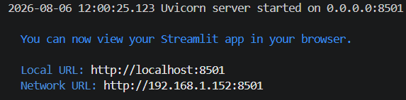

# ScaffoldAI
Version: ScaffoldAI v0.1-SU26

This was built in Python with the Streamlit framework. View the documentation for Streamlit [here](https://docs.streamlit.io/). If you need help setting up the repository, please read the [Repository Setup Guide](readme_assets/REPOSETUP.md). It assumes that you have no prior knowledge of VSCode or GitHub.

## Installation 
install the requirements. 

```
pip install -r requirements.txt
```
or
```
python -m pip install -r requirements.txt
```

To run the app on your browser. 
```
python -m streamlit run prototype\app.py  
```
or
```
streamlit run prototype\app.py 
```

The following is an example terminal ouput: <br />
 <br />
While it should automatically open it up on your browser, you can also access it through the Local URL. 

You must have an OpenAI API key to use the chatbot features. You must also have the Supabase information for the passwords. Thse can be added through an .env and .streamlit\secrets.toml file. 

## OpenAI API Key
* Please ask first for an OpenAI API Key before adding money to your OpenAI account. 

To create an OpenAI API Key:
* https://platform.openai.com/api-keys -> Sign in -> Create New Secret Key 
    * Copy and save your Secret Key because you can't access it after the popup
    * You need at least $5 in your OpenAI account 
    * https://platform.openai.com/settings/organization/billing/overview -> To add money into your OpenAI account.
      
## Enviroment Variable
* Copy the .env.example file and rename it .env
  * Replace the sample OpenAI API Key with your own

or

* Create an .env file in your directory
* Add the line OPENAI_API_KEY={KEY}
  * Replace {KEY} with your own OpenAI API Key

## Supabase
The Supabase URL and key needs to be given. You can't create it as it has data specific to the app.

* Copy the .streamlit\secrets.toml.example file and rename it secrets.toml. It must be in the .streamlit folder.
  * Replace the SUPABASE_URL and SUPABASE_KEY with the given URL and key. Do not remove the quotes.

or

* Create an secrets.toml file in the .streamlit folder.
* Add the following text in the file:

```
[connections.supabase]
SUPABASE_URL = "{URL}"
SUPABASE_KEY = "{KEY}"
```
* Repplace the {URL} and {KEY} with the given URL and key. Do not remove the quotes.