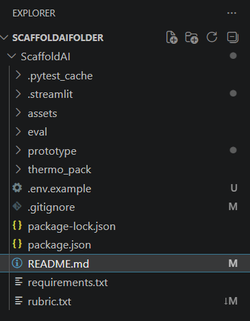

# Repository Setup Guide
* Visual Studio Code is installed. VSCode can be installed [here](https://code.visualstudio.com/download?_exp_download=fb315fc982).
* The repository should be downloaded locally. To set it up, do the following steps. 
1. In your File Explorer, create a folder. The folder's name doesn't matter. For reference, the README uses "ScaffoldAIFolder" as its name. 
2. Open Visual Studio Code on your computer.
3. Open the created folder. On the top-left bar, click File -> Open Folder or use the shortcut: Ctrl+K Ctrl+O. If asked, trust the folder.
4. Open a new terminal. On the top-left bar, click Terminal -> New Terminal or use the shortcut: Ctrl+Shift+`
5. Input the following command.
```
git clone https://github.com/JosephineC38/ScaffoldAI.git
```
If done correctly, you should see a setup like the following image. <br />
  

6. Input the following command on your terminal.
```
cd ScaffoldAI
```

The README assumes that you are in the ScaffoldAI folder. If the text is in the following format:
```
Example Terminal Command
```
Please copy and paste the command into the terminal.

You finished setting up the repository! Please go back to the README for further instructions.


